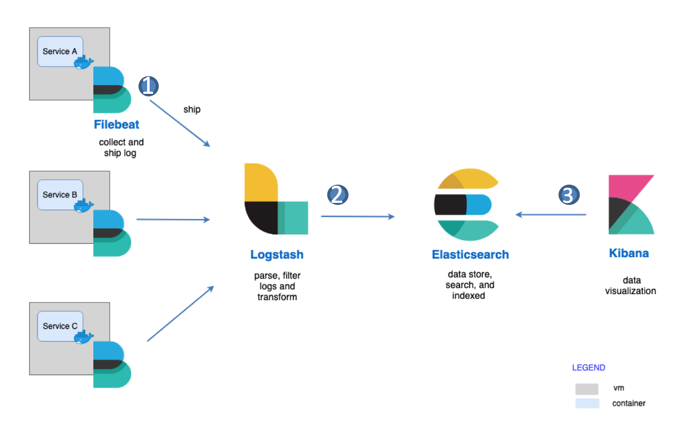

## Centralized Log Management Service using Elastic Stack 

### Architecture Diagram



### Services installed in AWS EC2
- [Elasticsearch](http://ec2-18-138-255-71.ap-southeast-1.compute.amazonaws.com:9200/)
- [Kibana](http://ec2-18-138-255-71.ap-southeast-1.compute.amazonaws.com:5601/app/kibana)
- [Cerebro](http://ec2-18-138-255-71.ap-southeast-1.compute.amazonaws.com:9000/#/overview?host=http:%2F%2Fes01:9200)

### Install Elastic Stack with Docker Compose

- Configuring system settings for Elasticsearch
  - Change the vm.max_map_count to at least 262144 for production use
  - Change the max number of open files for the elasticsearch
  
  ```yml
  ulimits:
      memlock:
        soft: -1
        hard: -1
      nofile:
        soft: 65536
        hard: 65536
  ```

### Basic Operations
 
- Cluster Healthy Check:

```bash
curl -XGET 'http://localhost:9200/_cat/health?v'
curl -XGET 'http://localhost:9200/_cluster/health?pretty'
```


- Examining Individual Nodes:

```bash
curl -XGET 'localhost:9200/_nodes/stats'
```

- List All Indices:

```bash
curl -XGET 'http://localhost:9200/_cat/indices?v'
```

- Get a specific index:

```bash
curl -XGET 'http://localhost:9200/{index_name}'
```

- Delete an index: 

```bash
curl -X DELETE http://localhost:9200/{index_name}
```